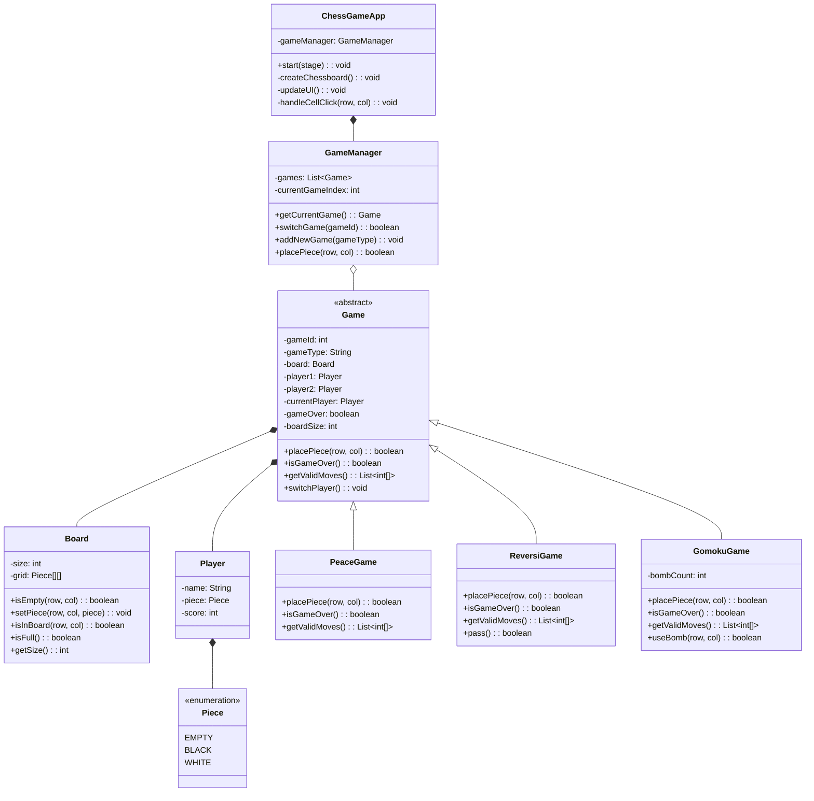
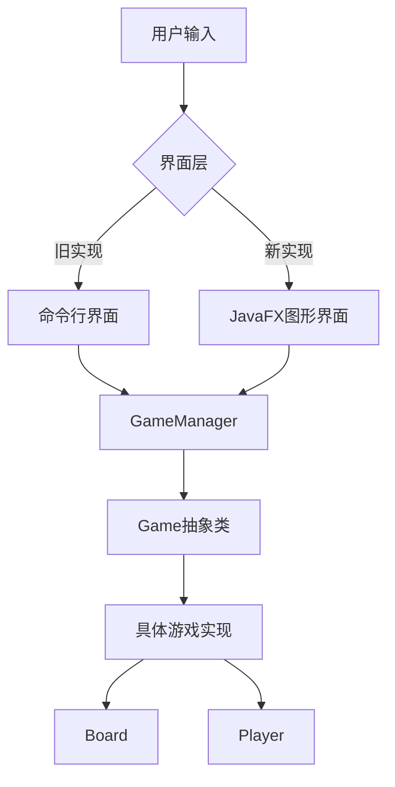
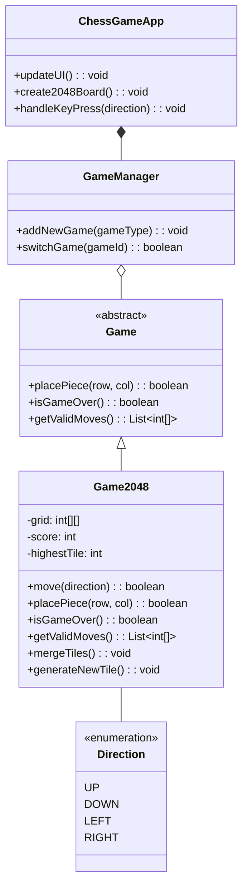
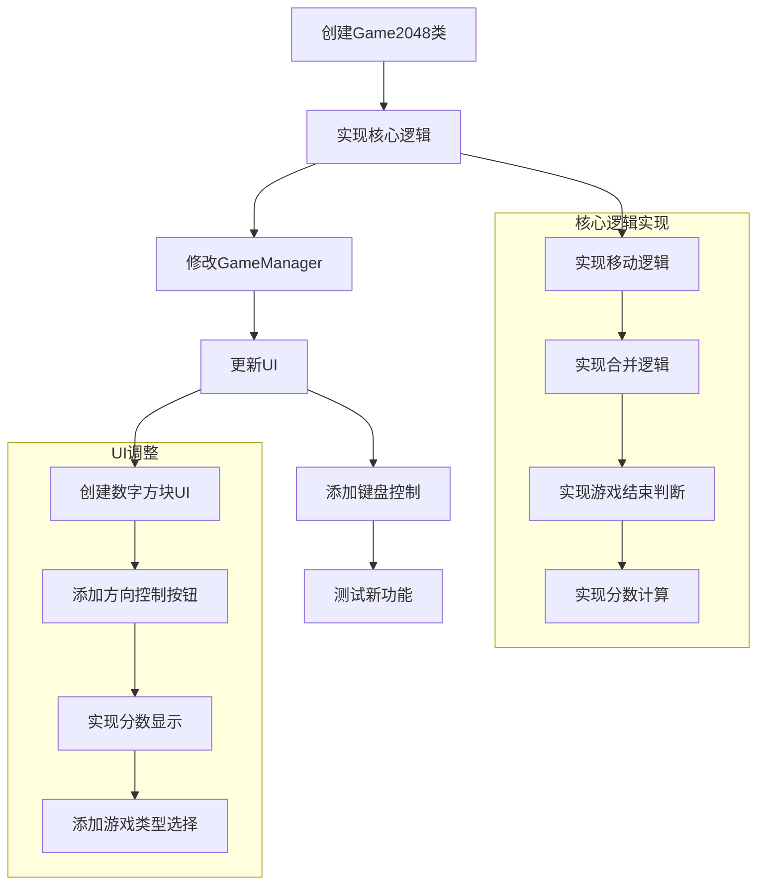

# 棋类游戏项目分析

## 1. GUI实现对原代码的复用情况分析

### 项目结构与代码复用

项目采用了面向对象的设计模式，通过抽象基类和接口实现了高度的代码复用。从命令行界面到图形用户界面的转换中，保留了核心的游戏逻辑，同时增加了视觉表现层。

#### 代码复用分析

#### 复用率分析

| 组件 | 复用情况 | 说明 |
|------|---------|------|
| `Game`类 | 完全复用 | 抽象基类定义了所有游戏通用的方法和属性，无需修改 |
| `Board`类 | 完全复用 | 棋盘逻辑被完全保留，仅增加了UI表现层 |
| `Player`类 | 完全复用 | 玩家信息和状态管理保持不变 |
| `Piece`枚举 | 完全复用 | 棋子类型定义保持不变 |
| 游戏实现类 | 完全复用 | `PeaceGame`、`ReversiGame`、`GomokuGame`的核心逻辑保持不变 |
| `GameManager`类 | 大部分复用 | 保留了游戏管理逻辑，增加了与UI交互的方法 |
| UI相关代码 | 全新实现 | `ChessGameApp`是全新的JavaFX应用类，替代了原有命令行界面 |

**总体复用率：约80%**

主要的变化集中在用户界面层面，核心游戏逻辑和数据模型几乎完全保留。通过将UI和业务逻辑分离，实现了高度的代码复用。

### 新旧实现的依赖关系

## 2. 添加新游戏类型的分析

### 添加2048游戏需要的调整

要在现有结构上添加2048游戏，需要做以下调整：

#### 类图分析

#### 必要的修改

1. **创建`Game2048`类**：
   - 继承`Game`抽象类
   - 实现2048特有的游戏逻辑（合并相同数字的方块、生成新方块等）
   - 重写必要的方法（`placePiece`、`isGameOver`、`getValidMoves`）
   - 添加特有方法（如`move`方向移动、`mergeTiles`等）

2. **修改`GameManager`类**：
   - 在构造函数中添加2048游戏实例
   - 在`addNewGame`方法中添加创建2048游戏的逻辑
   - 在`switchGame`方法中添加对2048游戏类型的处理
   - 添加2048游戏特有操作的方法（如`moveInDirection`）

3. **修改`ChessGameApp`类**：
   - 在UI中添加2048游戏的显示逻辑
   - 添加键盘事件处理（上下左右移动）
   - 添加得分显示
   - 更新游戏列表和控制面板

4. **添加新资源**：
   - 为2048游戏添加颜色和样式定义
   - 添加方向键控制的按钮

#### 调整细节

### 结论

通过项目的良好设计，添加新游戏类型（如2048）变得相对简单。主要工作集中在实现新游戏的特有逻辑和调整UI显示，而不需要修改现有游戏的代码，体现了开闭原则。核心架构的可扩展性使得项目能够轻松适应新需求。 